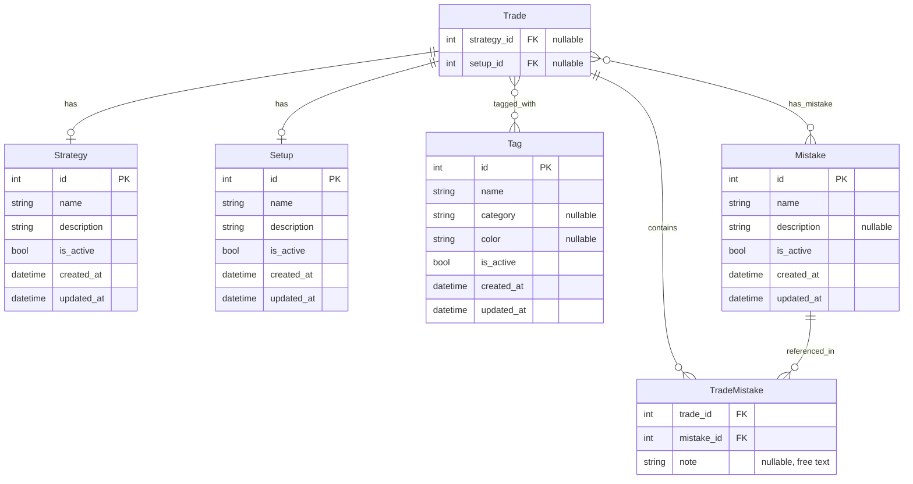

# Discovery: Trade Context & Classification

**Change:** `trade-context-classification`
**Phase:** Discovery
**Date:** 2026-07-09

> Domain model decisions for Strategy, Setup, Tags, and Mistakes.
> Approved decisions here are binding for Proposal → Spec → Design → Tasks.
> Any change to this document requires a new Discovery review.

---

## Domain Model

## Entity Definitions

### Strategy (catalog)

| Field | Type | Notes |
|-------|------|-------|
| `id` | PK | autonumeric |
| `name` | str | unique, non-null |
| `description` | str | nullable |
| `is_active` | bool | default true; soft-delete |
| `created_at` | timestamp | auto |
| `updated_at` | timestamp | auto |

**Cardinality:** 1 Strategy per Trade (FK `Trade.strategy_id`). `NULL` = no strategy assigned.

### Setup (catalog)

| Field | Type | Notes |
|-------|------|-------|
| `id` | PK | autonumeric |
| `name` | str | unique, non-null |
| `description` | str | nullable |
| `is_active` | bool | default true; soft-delete |
| `created_at` | timestamp | auto |
| `updated_at` | timestamp | auto |

**Cardinality:** 1 Setup per Trade (FK `Trade.setup_id`). Independent of Strategy — no hierarchy.

### Tag (catalog)

| Field | Type | Notes |
|-------|------|-------|
| `id` | PK | autonumeric |
| `name` | str | unique, non-null |
| `category` | str | nullable; e.g. "session", "psychology", "market", "volatility" |
| `color` | str | nullable; hex or semantic color |
| `is_active` | bool | default true; soft-delete |
| `created_at` | timestamp | auto |
| `updated_at` | timestamp | auto |

**Cardinality:** N:M via `trade_tags` pivot. Zero to many per Trade.

### Mistake (catalog)

| Field | Type | Notes |
|-------|------|-------|
| `id` | PK | autonumeric |
| `name` | str | unique, non-null; e.g. "Entered before BOS" |
| `description` | str | nullable; explanation of the mistake type |
| `is_active` | bool | default true; soft-delete |
| `created_at` | timestamp | auto |
| `updated_at` | timestamp | auto |

**Cardinality:** N:M via `trade_mistakes` pivot with `note` (nullable free text). Zero to many per Trade.

### TradeMistake (pivot)

| Field | Type | Notes |
|-------|------|-------|
| `trade_id` | FK → Trade.id | PK part 1 |
| `mistake_id` | FK → Mistake.id | PK part 2 |
| `note` | str | nullable; contextual detail about the mistake on this particular trade |

### trade_tags (pivot)

| Field | Type | Notes |
|-------|------|-------|
| `trade_id` | FK → Trade.id | PK part 1 |
| `tag_id` | FK → Tag.id | PK part 2 |

**Note:** `trade_tags` is intentionally flat (no `note`, no `category` override). A tag is just a classification marker.

---

## Business Rules

### BR-ARCHIVE: Archived catalog elements

| Rule | Description |
|------|-------------|
| `is_active = false` | Element is hidden from selectors for new/edit trades |
| Existing references | Trades with FK to archived elements still render the element's `name` normally |
| Editing old trades | User MAY keep an archived element or change it to an active one |
| Physical DELETE | Not allowed. All deletions are soft via `is_active` |
| Rename | Allowed at any time. FK references guarantee historical consistency |

### BR-NULL: Optional assignments

- `Trade.strategy_id` MAY be `NULL` (no strategy assigned)
- `Trade.setup_id` MAY be `NULL` (no setup assigned)
- A Trade MAY have zero tags, one tag, or many tags
- A Trade MAY have zero mistakes, one mistake, or many mistakes
- If all context elements are empty, the trade still renders correctly (pre-v0.9 behavior)

### BR-CATALOG: Catalog administration

- All catalogs (Strategy, Setup, Tag, Mistake) are **administerable from the UI**
- Accessible via `/settings/strategies`, `/settings/setups`, `/settings/tags`, `/settings/mistakes`
- CRUD operations:
  - **Create**: insert new element (auto `is_active = true`)
  - **Read**: list active elements; optionally show archived
  - **Update**: rename, edit description, change category/color (tags)
  - **Archive**: set `is_active = false`. Fails if the element has references? → Allowed. References show name but selector hides it.

---

## Changes to Existing Schema

| Entity | Change |
|--------|--------|
| `Trade` | No schema changes. `strategy_id` and `setup_id` exist as nullable int columns. |
| `TradeReview` | No changes. Review (`content`, `lesson_learned`) is separate from context. |
| New table | `strategies` |
| New table | `setups` |
| New table | `tags` |
| New table | `mistakes` |
| New table | `trade_tags` (pivot) |
| New table | `trade_mistakes` (pivot with `note`) |

---

## Out of Scope (explicit)

- Strategy/Setup checklists
- Hierarchy (Strategy → Setup)
- Tag categories (modeled but not enforced/used in this SDD — deferred to UI phase)
- Auto-tagging or AI classification
- Analytics, dashboards, reports, stats
- Versioning of catalog elements
- Bulk operations

---

## Decisions Log

| # | Decision | Rationale |
|---|----------|-----------|
| D-01 | Strategy via FK on Trade (1:1) | Single strategy per trade reflects one execution plan |
| D-02 | Setup independent of Strategy | No use case for hierarchy yet; keeps it simple |
| D-03 | Tags N:M via pivot | A trade can belong to multiple categories |
| D-04 | Mistakes N:M with `note` | Catalog for stats + optional context per trade |
| D-05 | `category` + `color` on Tag | Future-proof for zero cost; frontend ignores for now |
| D-06 | Soft-delete everywhere | `is_active` pattern, same as Trade |
| D-07 | Catalogs editable from UI | Under `/settings/*` — avoids SQL/scripts for daily ops |
| D-08 | Archived elements still render on existing trades | FK + `is_active` separation makes this trivial |
